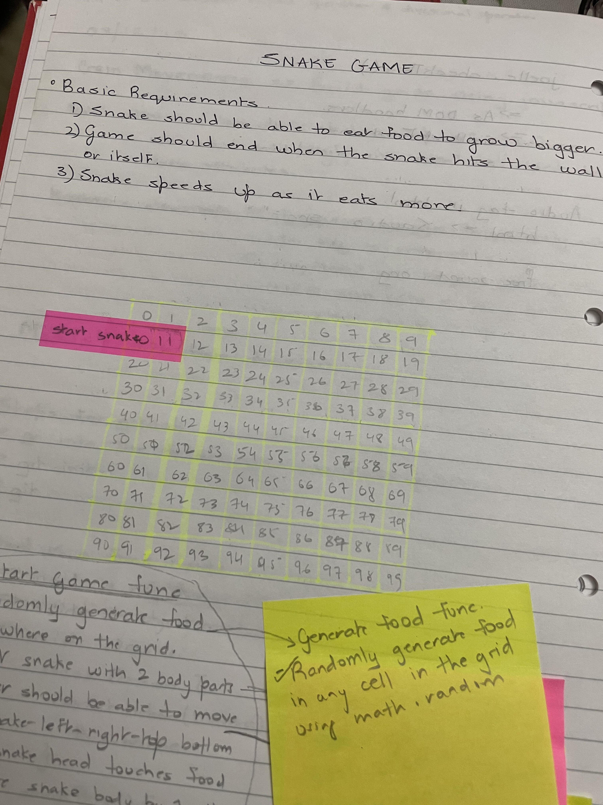
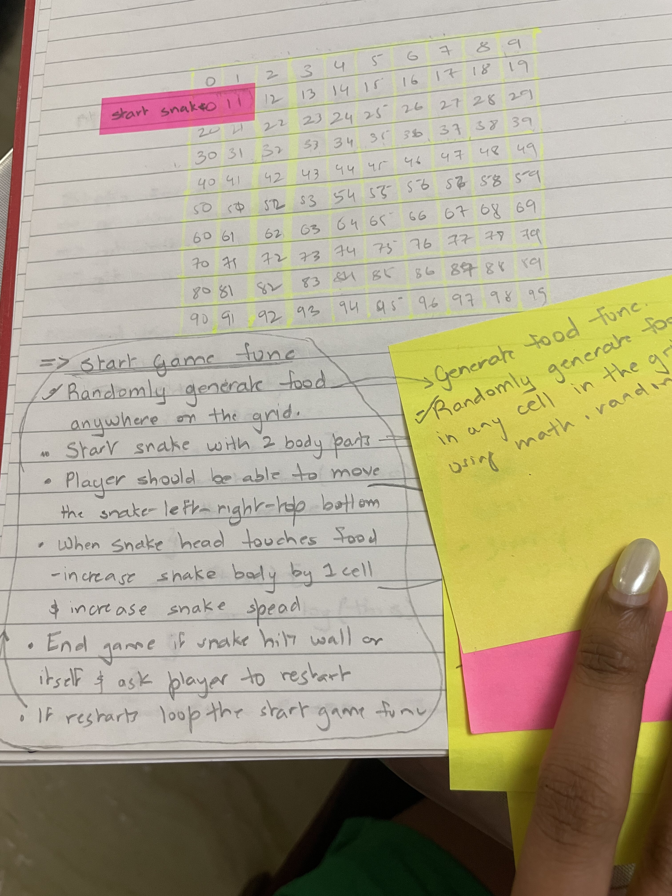
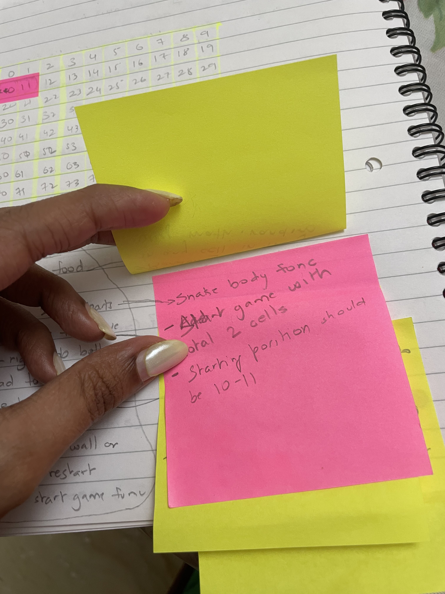
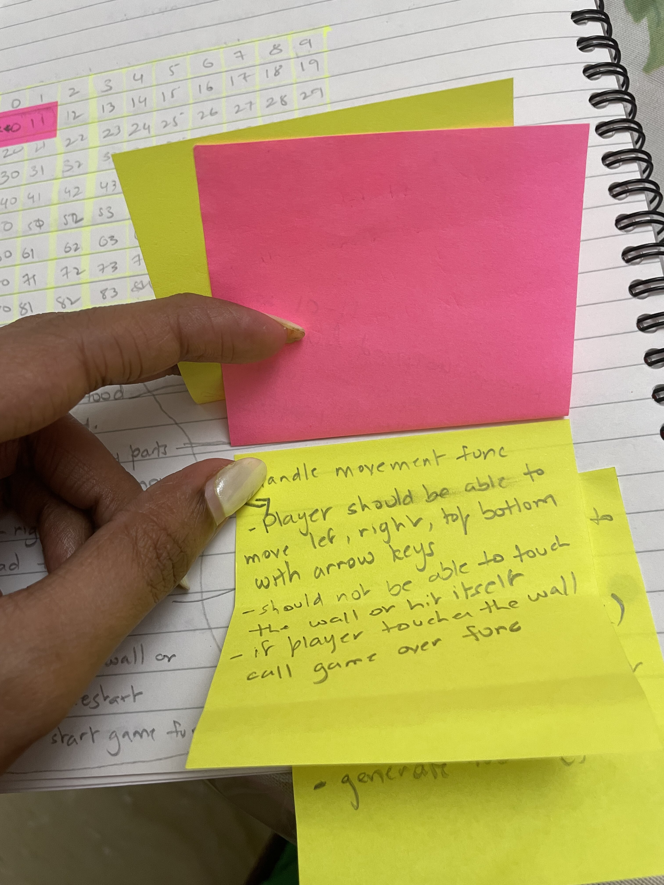
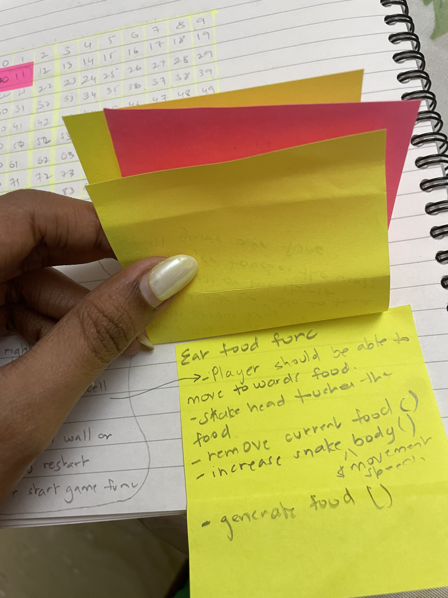

# ReadMe Retro Snake

## Description

A retro snake game, something basic like the one we loved to tire our fingers out. I decided on this game to bring my childhood memories back to life.

The game is built using HTML, CSS and JavaScript’ grid system.

As mentioned, I wanted my game to instantly take you back to the early 2000’s (if you were born then and old enough to be using a phone) and what better name to call it than ‘RETRO SNAKE’. I believe my visuals and sound will teleport you back to the dawn of mobile phone games.

Enjoy!

## Deployment link

https://github.com/EvylinaAn/Unit1_Snake_Game.git https://evylinaan.github.io/Unit1_Snake_Game/

## Timeframe and working team

This is a solo project with 1 week completion time. My game took approximate 5 days to complete.

## Technologies used

Front End game making use of HTML, CSS and JavaScript's grid system and DOM manipulation.

## Brief

The first requirement was to complete the game in a week’s time using JavaScript’s grid movement and avoid the use of HTML Canvas.

We had a set of games to pick from and each of them had some basic requirements that had to be met in order to get a passing grade. Anything additional was a bonus.

As I chose the snake game, I have 3 basic requirements. They were as follows.

1. The snake should be able to eat food and grow bigger.
2. The game should end when it hits the wall or itself.
3. Snake speeds up as it eats more.
   We were suggested to add audio to our files, also focus on the functional part of the game first and make style enhancements once the game is playable.

## Planning

As soon as I picked my game, the most crucial part of the process began - ‘The Plan’.








I started with writing down my basic requirements, drawing out my grid, planning out my functions, variables, constants and everything else I imagined I would require to build my game. I also decided to make a detailed plan of how much I would do each day to ensure I had my project completed on time.

## Build/Code Process
Started my game code with basic HTML where in the body consisted of a few elements. This includes, a div to display the game over text when the snake hits the wall or itself, a section tag that displays the scores (current score and high score), a main tag which acts as the main container for the game within which it holds the game grid section and finally a button to reset the game.

I then worked on my basic CSS rules to centre my grid, add fonts and minimal styling to my game grid and the whole page. I also styled my game divs in advance as I was aware of the size I needed them to be and styled by button.

Finally, the most important part of any modern day coding structure, the JavaScript.

I started off with creating a function that would nest my whole game, catch my HTML elements , and create my const and let variables. I then created the structure of my grid by putting it into a function and used a startGame function to call my createGrid function. I also added an event listener to listen for any key press and start moving the snake only when an arrow key is pressed.

I then created a function to generate random food, remove food and a function to remove food from the snake body by adding a condition to check if the snake’s body consists of snake food, if so remove the food and regenerate food.

I also created a function to add snake and remove snake. My move snake function has a set interval to move the snake automatically in the direction of the click and this function consists of a few other function calls and methods including the handle move function which listens for a click on the arrow keys.

I created an eat food function which checks if the snake head and food are in the same position and if so remove food, regenerate it and add 1 to the snake in order to make the snake grow.

I also added a function to check if the snake head has hit itself or the wall, if the game is over and another function to reset the game.

Inclusive of all the main functions I have added a few other functions such as, generating a random food colour another function to block the edge cells and convert it into a wall

```
function randomFoodColor() {
        const red = Math.floor(Math.random() * 255) + 50;
        const green = Math.floor(Math.random() * 255) + 50;
        const blue = Math.floor(Math.random() * 255) + 50;
        const opacity = 1;
        return (randomColor = `rgb(${red}, ${green}, ${blue}, ${opacity})`);
}

function generateRandomFood() {
        food = Math.floor(Math.random() * 400);
        cells[food].classList.add("snakeFood");
        cells[food].style.backgroundColor = randomFoodColor();
}

function borderCells() {
        for (let i = 0; i < cells.length; i++) { 
                if(
                        i < width ||
                        i % width === 0 ||
                        i > width ** 2 - width - 1 ||
                        i % width === width - 1
                ){ 
                        cells[i].classList.add("border"); 
                        if (
                                cells[i].classList.contains("snakeFood") &&
                                cells[i].classList.contains("border") 
                        ){
                                console.log("food in border");
                                removeFood();
                                generateRandomFood();
                        }       
                }
        } 
}
```

## Challenges and Wins
There are a few of things that I struggled with here and things that I am extremely proud of. First one being by conditional to check if the snake collided into itself would break my whole code when I tried using the generic way of checking. So instead I used the slice method that would check if the snakes head is equal to the snakes body. Here’s a snippet of the same

```
function checkCollision() {
        let slicedSnake = currentPosition.slice(1); slicedSnake.forEach((slice) => {
                if(
                        currentPosition[0] === slice ||
                        (currentPosition[0] % width === width - 1 && direction === 1) ||
                        (currentPosition[0] - width < 0 && direction === -width) || (currentPosition[0] % width === 0 && direction === -1) ||
                        (currentPosition[0] + width >= width \* width && direction === +width) 
                ){
                        isGameOver = true;
                        gameOver();
                }
        })
}
```

The second thing I struggled with a lot was that my snake would die as soon as it hit border divs and not the actual wall. To solve this problem I decided to turn my edge cells into walls and that way the snake dies when it hits the border cell. I am really happy with the way I coded this part. Below is the snippet for my border cells function that I then called in my move snake function.
```
function borderCells() {
        for (let i = 0; i < cells.length; i++) {
                if (
                        i < width ||
                        i % width === 0 ||
                        i > width \*\* 2 - width - 1 ||
                        i % width === width - 1
                ){ 
                        cells[i].classList.add("border") 
                        if (
                                cells[i].classList.contains("snakeFood") &&
                                cells[i].classList.contains("border") 
                        ){
                                console.log("food in border");
                                removeFood();
                                generateRandomFood();
                        } 
                }
        } 
}
```
Lastly, another part of the build process I found slightly challenging was understanding the logic to move the snake automatically and then increase the speed every time the snake eats food. It took me some time to understand what I need to be doing her and finally managed to get it working.

```
function moveSnake() {
        clearInterval(snakeInterval);
        snakeInterval = setInterval(() => {
                gameLoopSound.play();
                gameLoopSound.loop = true;
                borderCells();
                removeFoodFromSnake();
                let tail = currentPosition.pop();
                cells[tail].classList.remove("snake");
                removeSnake();
                currentPosition.unshift(currentPosition[0] + direction);
                addSnake();
                eatFood();
                checkCollision();
        }, interval);
}

function eatFood() {
        if (food === currentPosition[0]) { 
                eatFoodSound.play(); removeFood(); generateRandomFood();
                let tail = currentPosition[currentPosition.length - 1];
                currentPosition.push(tail);
                currentScore++;
                score.innerHTML = currentScore;
                if (score.innerHTML !== "0") { 
                        score.classList.add("popUpScore");
                }
                clearInterval(snakeInterval);
                interval = interval \* speed;
                snakeInterval = setInterval(moveSnake, interval);
        } 
}
```
## Key Learnings/Takeaways
The day the project was first announced, I had a mini panic attack as I did not think I would be able to make a game, even if it was just a basic snake game (it’s funny that I call it basic now, that word didn’t exist in my vocabulary on day 1 of project week).

The first day I spent on planning watching videos of other people building the game and finally got started on my retro snake. I believe now a week later, I have never felt as confident as I do with my ability to code and use any online resources available to help me learn and understand concepts better.

Before I built retro snake, I struggled with functions quite a lot and told myself that if I was going to build a game I was gonna use as many functions as I could to understand it a bit better. That is exactly what happened, I now feel quite comfortable with functions and understand it a lot better than I did 1 week ago. I learnt how calling functions in the right place makes the biggest difference. Although I didn’t end up using any arrow functions in my code but I did work with a few of them while I was building my game and scrapped the idea of using arrow functions because of the issues I had with scoping them however, I can now say I understand the difference between the function declarations, expressions and arrow functions a lot better now.

I also learnt about the grid system in javascript and realised how much better it is to not hard code the layout if it’s not necessary. I did enjoy working with grid movements.

Lastly, working with audios and adding audios to my file that plays when it goes through some logic was game changing (literally). Adding sound effects made my game so much more interesting.

## Bugs
I’ve got a few bugs in my game, some major ones and some minor ones. They all need fixing nevertheless.

Firstly and the main one, my game over function breaks when I reset the game using the reset button. It randomly places the game over sound while the game is not yet over, my score board acts funny and the eat food function sometimes will not play the sound or count the score.
Including the major bug, I also have some slight visual bugs such as..

a) When food generates in the snake body and the border cells, they get taken off automatically and are regenerated elsewhere in my game grid. However, you can visually still see the food in the snake’s body and wall very briefly even though this bug doesn’t break my game functionality, I would like it not be visible at all. I did try using transitions in my css to help with it and it did but only slightly.
b) When the snake hits the walls and dies, it’s head goes inside the actual wall making it difficult for me to style the snake differently when it dies.

## Future improvements
Fix all my bugs and mainly the game over, reset button function and the other 2 minor bugs. I also want to implement a leaderboard and will make use of local storage to implement this.
I also want to make my game responsive so it is playable on a mobile phone and may need to implement some button clicks there.
I also want to add a mute button in order to be able to mute the music in case a player doesn’t want any sound.
